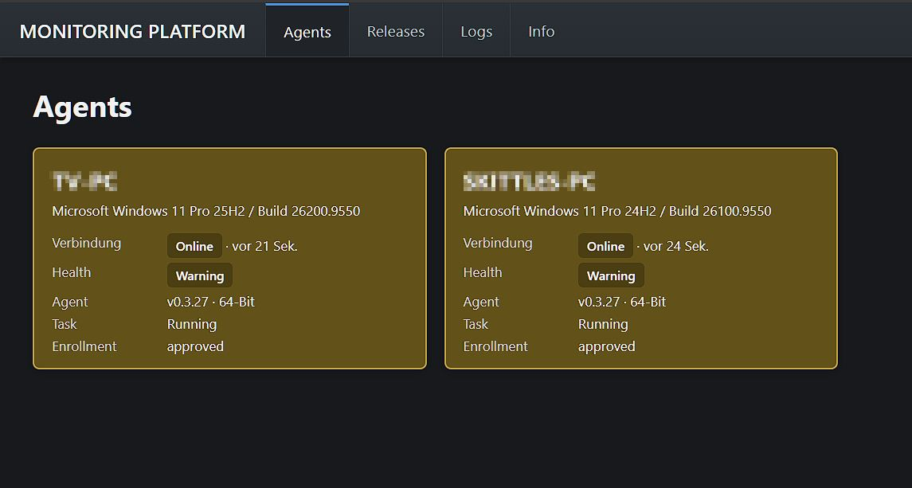
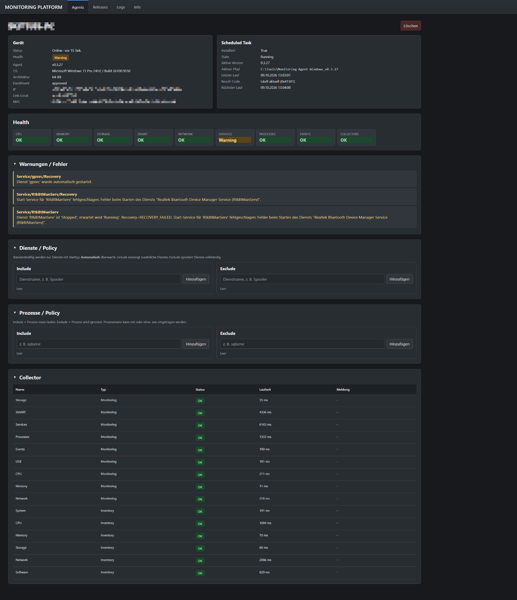
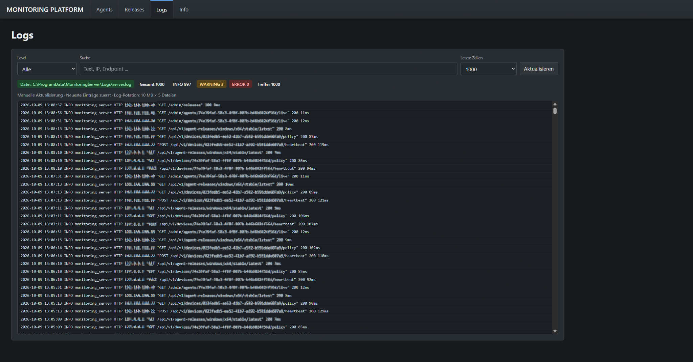
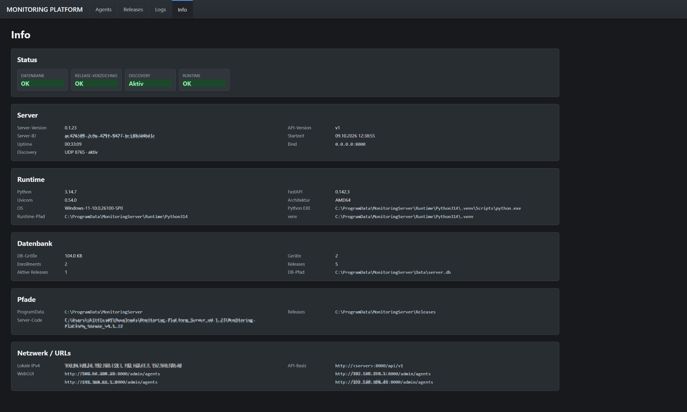

# Monitoring Platform

> **Monitoring Platform is a private, non-commercial hobby project.**  
> It is developed primarily for personal use, testing, experimentation and learning. It is not a commercial product and no commercial support, warranty or SLA is provided.

Monitoring Platform is a modular self-hosted monitoring project for heterogeneous environments.

The project currently consists of a central FastAPI-based server and a Windows agent. The architecture is designed to grow beyond Windows, with Linux agents, ESP32/IoT devices, network discovery and custom collectors planned.

## Screenshots

The screenshots below show the current WebGUI during development. Hostnames, addresses and identifiers have been anonymized.

### Agent overview



### Agent details, health and policies



### Server logs



### Server information



## Current components

| Component | Current version | Status |
|---|---:|---|
| Monitoring Platform Server | 0.1.23 | Active development |
| Windows Agent | 0.3.27 | Active development |
| Legacy Windows Agent | Design/check phase | Windows Server 2012 / 2012 R2 |
| Linux Agent | Planned | — |
| ESP32 / IoT | Planned | — |
| Custom Collectors | Planned | — |

## Architecture

```text
Monitoring Platform
├─ Server
├─ Agents
│  ├─ Windows
│  ├─ Legacy Windows
│  ├─ Linux            (planned)
│  └─ ESP32 / IoT      (planned)
├─ Discovery
└─ Integrations / Custom Collectors
        ↓
     Devices
        ↓
 Current State / Events / History
        ↓
      REST API
        ↓
       WebGUI
```

The Windows agent uses a persistent identity and enrolls with the central server. Policies are managed centrally. The update path supports versioned installations, SHA-256 validation, activation through `active-version.json` and rollback after failed activation.

## Repository layout

```text
server/                Monitoring Platform Server
agents/windows/        Current Windows agent
agents/legacy-windows/ Reserved for the future legacy implementation
docs/                  Cross-component documentation
.github/workflows/     CI checks
```

## Core principles

- Device and agent are separate concepts.
- Enrollment requires explicit approval.
- Agent UUIDs persist across updates and restarts.
- The server derives offline state from missing heartbeats.
- Standard agents contain only general-purpose monitoring functions.
- Customer-specific or application-specific checks belong in Custom Collectors.
- Unsupported legacy APIs must be reported as `Limited`, `Unknown` or `Unsupported`, not as false `Critical` failures.

## Windows agent capabilities

The current Windows agent includes:

- CPU and memory monitoring
- storage utilization
- SMART collection
- network information
- service monitoring and optional auto-recovery
- service include/exclude policy
- process monitoring and required-process policy
- Windows Event Log collection
- inventory collection
- scheduled-task runtime/status
- server discovery
- enrollment and persistent identity
- centralized policy synchronization
- auto-update, validation and rollback

## Status thresholds

Storage currently uses:

- Warning: 90%
- Critical: 95%

## Development status

Interfaces, schemas and installation procedures may still change between releases.

See [ROADMAP.md](ROADMAP.md) for the planned direction and [SECURITY.md](SECURITY.md) for security-related guidance.

## License

No open-source license has been selected yet. Until a license is added, normal copyright rules apply.
